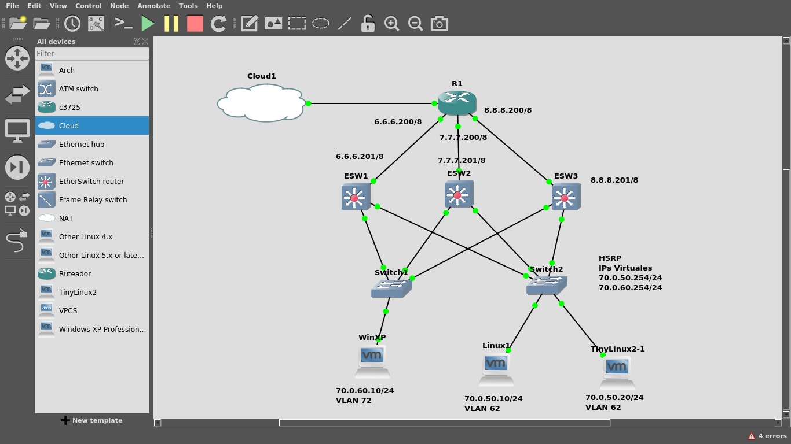
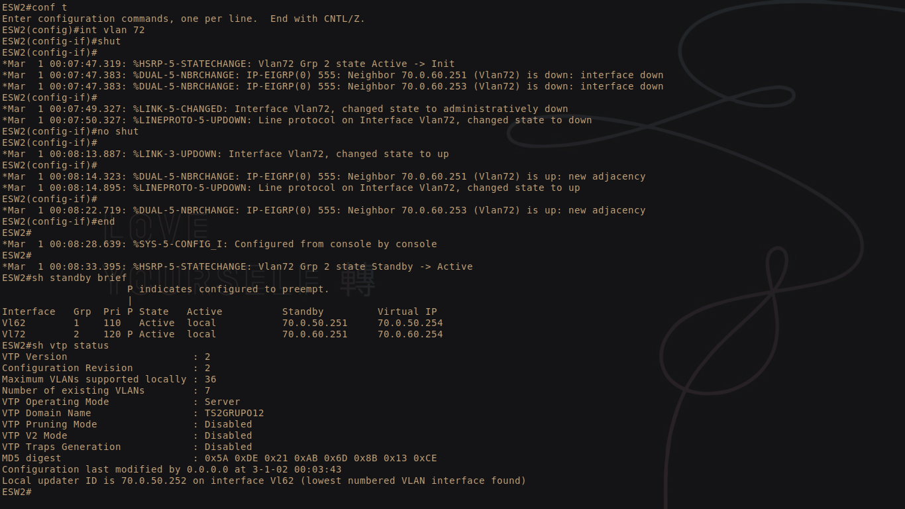
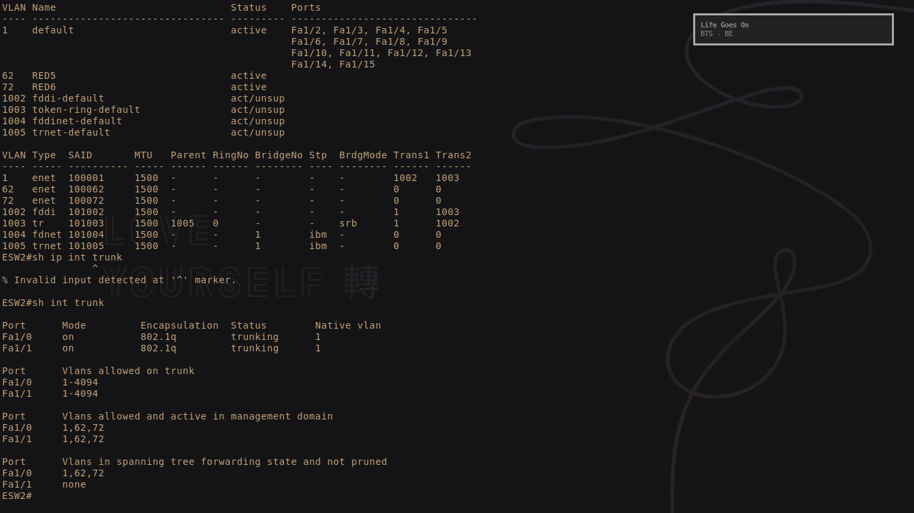
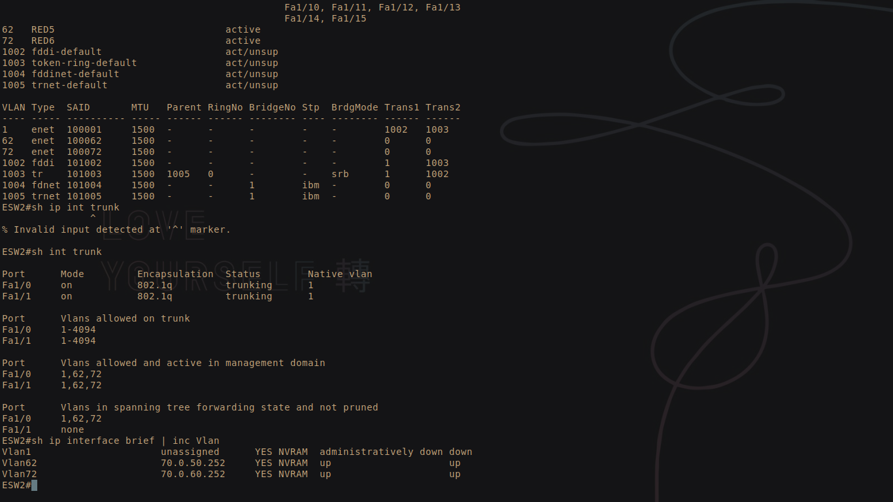
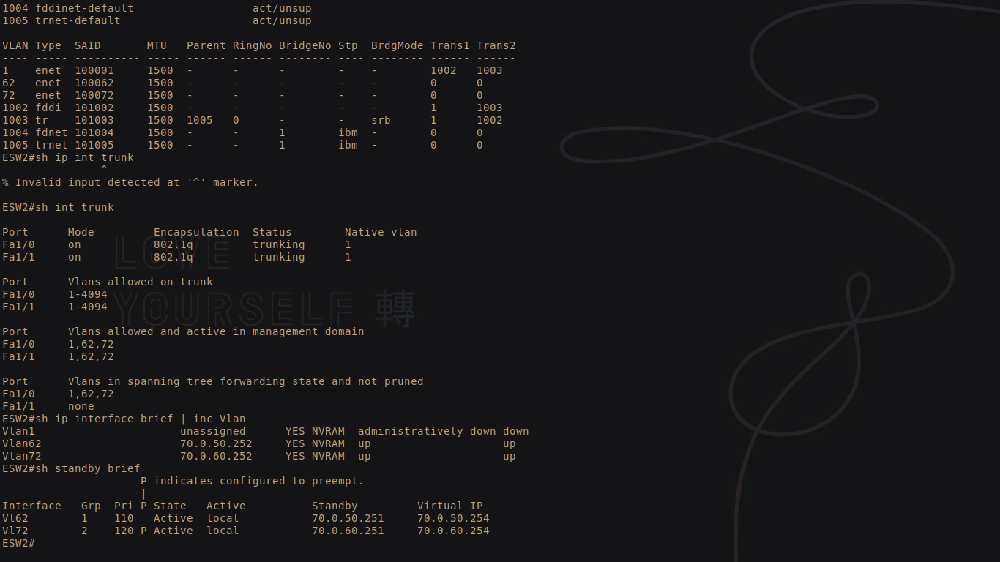
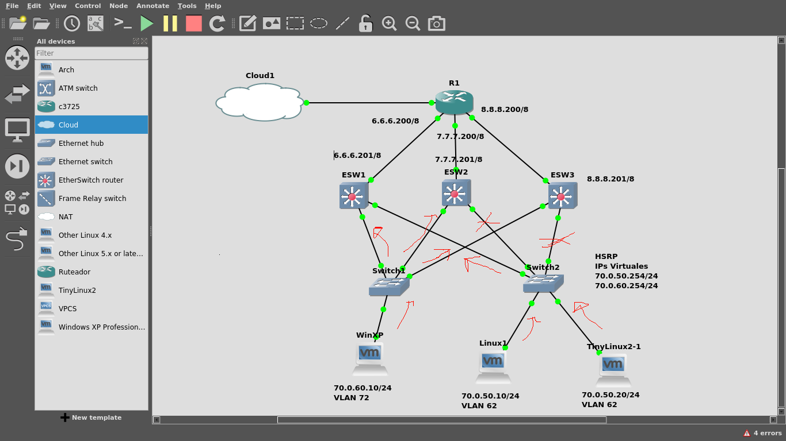
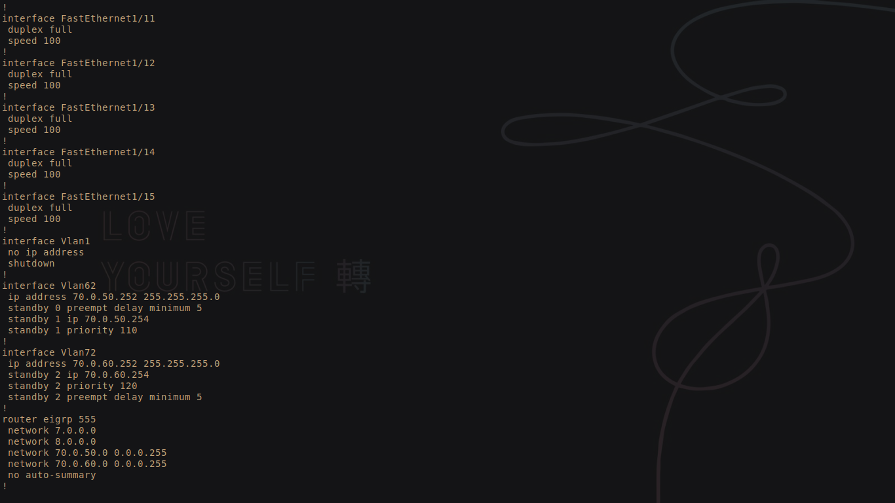
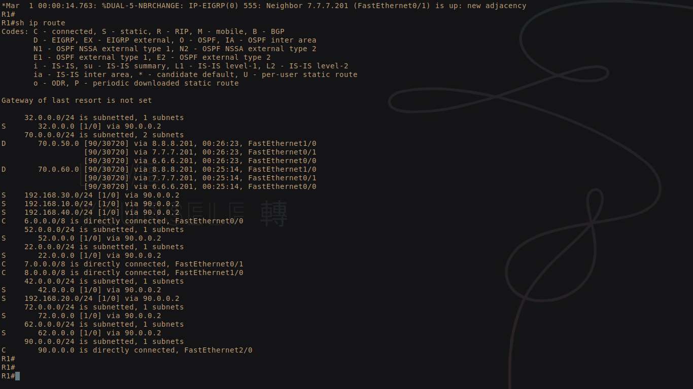

# Redes1-Proyecto1_Grupo12
## 201700326
## 201709244

## Definición de las redes topologia 1

| Direccion de Red | Primera Direccion Asignable | Ultima Direccion Asignable | Direccion de Broadcast |
|:-------------:|:-------------:|:-------------:|:-------------:| 
| 192.168.40.0/24 | 192.168.40.1 | 192.168.40.254 | 192.168.40.255 |
| 192.168.30.0/24 | 192.168.30.1 | 192.168.30.254 | 192.168.30.255 |
| 192.168.20.0/24 | 192.168.20.1 | 192.168.20.254 | 192.168.20.255 |
| 192.168.10.0/24 | 192.168.10.1 | 192.168.10.254 | 192.168.10.255 |
| 22.0.0.0/24     | 22.0.0.1     | 22.0.0.254     | 22.0.0.255     |
| 32.0.0.0/24     | 32.0.0.1     | 32.0.0.254     | 32.0.0.255     |
| 42.0.0.0/24     | 42.0.0.1     | 42.0.0.254     | 42.0.0.255     |
| 52.0.0.0/24     | 52.0.0.1     | 52.0.0.254     | 52.0.0.255     |
| 62.0.0.0/24     | 62.0.0.1     | 62.0.0.254     | 62.0.0.255     |
| 72.0.0.0/24     | 72.0.0.1     | 72.0.0.254     | 72.0.0.255     |
| 90.0.0.0/24     | 90.0.0.1     | 90.0.0.254     | 90.0.0.255     |

## Definición de las vlans topologia 1
| # VLAN | Nombre |
|:------:|:------:|
| 22     | RED1   |
| 32     | RED2   |
| 42     | RED3   |
| 52     | RED4   |

<h2>Topologia 1</h2>

## Configuracion

### VTP

### VTP modo servidor

Se necesita que Distribucion1 quede como el servidor

### Comandos:

- config t
- vtp domain {nombre}
- vtp password {contraseña}
- vtp mode server
- end

verificamos con sh vtp status

### VT modo cliente

Distribucion2 quedara como cliente

### Comandos:

- config t
- vtp domain {nombre}
- vtp password {contraseña}
- vtp mode client
- end

verificamos con sh vtp status

### Creación de VLANS

#### Comandos:
- conf t
- vlan {numero}
- name {nombre}
- end
  
Podemos ver en el ESW con vl, si estan todas las vlans creadas

### Configuración de puertos
- conf t
- interface {interface}
- switchport mode trunk
- end

Verificamos con "sh interfaces status"

En el switch de capa dos, con la ayuda de la GUI configuramos modo access y trunk

### Portchannel

- config t
- interfaces range fa{numero}/{numero} - {numero}
- channel-group {numero} mode on
- end

verificamos con sh etherchannel summary

### Interfaces vlan

Como necesitamos que el ESW funcione como gateway para la comuicación entre vlans, haremos 4 interafces logicas vlans.

### Comandos

- config t
- interface vlan {numero}
- ip address {ip} {mascara}
- end

Verificamos que todas las interfaces esten creadas con sh ip interface brief

### IPS Virtuales con HSRP

Tenemos 4 redes para las vlans, necesitamos que los dos esw funcionen como gateway entonces necesitamos 4 ips virtuales, 1 por cada interface vlan

### Comandos

- config t
- interface vlan {numero}
- standby {grupo} ip {direccion ip}
- standby {grupo} priority {numero de prioridad}
- standby {grupo} preempt delay minimum {numero}
- end

Verificamos con sh standby brief

### Ips interfaces de red

Cada router tendra su propia red, asignamos una ip a cada interfaz

### Comandos:

- config t
- interface fa{numero}/{numero}
- ip address {direccion} {mascara}
- end

verificamos con sh ip interface brief

### Aprender redes por medio de RIP

### Comandos:

- config t
- router rip
- version 2
- network {direccion de red}
- no auto-summary
- end

verificamos con sh ip route

### Aprender redes con ruteo estatico

- config t
- ip route {red a aprender} {mascara de la red} {ip de la interfaz}
- end

verificamos con sh ip route

### Captura de paquetes

Se capturara de un ping de la 192.168.40.20 a la 192.168.10.10 en el siguiente punto:

### Ruta principal

<h2>Topologia 2</h2>

## Definición de las redes topologia 2

| Direccion de Red | Primera Direccion Asignable | Ultima Direccion Asignable | Direccion de Broadcast |
|:-------------:|:-------------:|:-------------:|:-------------:| 
| 8.0.0.0/8 | 8.0.0.1 | 8.255.255.254 | 8.255.255.255 |
| 7.0.0.0/8 | 7.0.0.1 | 7.255.255.254 | 7.255.255.255 |
| 6.0.0.0/8 | 6.0.0.1 | 6.255.255.254 | 6.255.255.255 |
| 70.0.50.0/24   | 70.0.50.1     | 70.0.50.254     | 70.0.50.255     |
| 70.0.60.0/24   | 70.0.60.1     | 70.0.60.254     | 70.0.60.255     |

## Configuracion

### Configuracion del VTP
Lo primero que haremos para implementar la topologia mostrada sera configurar 
el protocolo VTP en los 3 ESWs. Siendo el ESW2 el vtp maestro y el resto 
seran vtp clientes.
Los comandos a utilizar para el ESW2 son:
- conf t
- vtp domain TS2GRUPO12
- vtp password TS2GRUPO12
- vtp mode server
- end

Los comandos a utilizar para el ESW1 y 3 son:
- conf t
- vtp domain TS2GRUPO12
- vtp password TS2GRUPO12
- vtp mode client

Para verificar la configuracion, utilizar el comando sh vtp status.

### Creación de las VLANs

Una vez esta configurado el protocolo VTP en los ESW, se procede a 
crear las vlans en el ESW maestro (ESW2) para que estas sean posteriormente
propagadas a los otros ESW.
#### Comandos:
- conf t
- vlan {numero}
- name {nombre}
- end
  
Podemos ver en el ESW2 con el comando sh vlan-sw,
si estan todas las vlans creadas.

### Configuración de puertos
Configuramos los puertos en modo Trunk para admitir conexión intervlan.

- conf t
- interface {interface}
- switchport mode trunk
- end

Pueden verificarse los puertos en modo tronco con el comando
sh int trunk

### Creacion de las interfaces vlan
Para implementar el correcto ruteo intervlan se procede a configurar 
una direccion IP para cada red vlan de la siguiente manera:

- conf t
- int vlan {VLAN NUMBER}
- ip address {IP ADDRESS} {MASCARA DE SUBRED}
- end

Hacemos el procedimiento en cada uno de los 3 ESWs asignandoles direcciones de
red validas dentro de cada vlan a las que estan asociadas. 
Puede verificarse la creacion de las interfaces vlan con el comando
sh ip interface brienf | inc Vlan

### Creacion del Gateway Virtual
Para implementar el protocolo de redundancia en el Gateway se escogio el 
protocolo HSRP. Se designo como equipo activo al ESW2, el ESW1 como standby
y finalmente el ESW3 como estado listen que asumira el estado de activo 
como ultimo en prioridad.

- conf t
- int vlan {VLAN NUMBER}
- standby 1 70.0.50.254
- standby 1 priority 120
- standby 1 preempt delay minimum 5
- end

Repetimos el procedimiento en cada Router con la misma direccion de red virtual, pero cambiando el numero de 
grupo y el numero de prioridad (la prioridad mas alta para el ESW2, luego el ESW1 y finalmente la mas
baja para el ESW3)
 
Puede verificarse la correcta configuracion del protocolo con el comando sh standby brief

### STP
Para verificar el correcto funcionamiento del STP, se han inspeccionado los puertos
habilitados y los bloqueados para evitar loops. La ruta resultante puede apreciarse 
a continuacion.

### Ruteo dinamico

### EIGRP

Procedemos a configurar el para el ruteo dinamico 
dentro de la topologia.

##### Comandos
- conf t
- router eigrp 555
- network 70.0.50.0 0.0.0.255
- network 70.0.60.0 0.0.0.255
- network 8.0.0.0 0.255.255.255
- no auto-summary
- end

### Ruteo estatico

Finalmente procedemos a configurar el ruteo estatico hacia
las redes de la topologia 1, siguiendo el formato:

#### R3
- conf t
- ip route {NETWORK IP} {MASK} {TARGET INTERFACE}

Realizamos este proceso para todas las 10 redes de la topologia
1 en cada uno de los ESW y en el Router R1.  
Finalmente comprobamos todas las redes aprendidas por el Router 
con el comando sh ip route.

Finalmente comprobamos realizando un ping a clientes de la topología 1.

