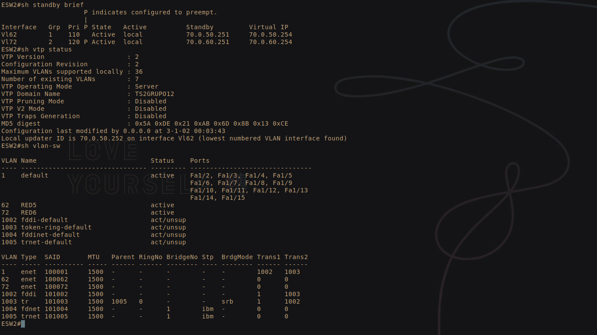
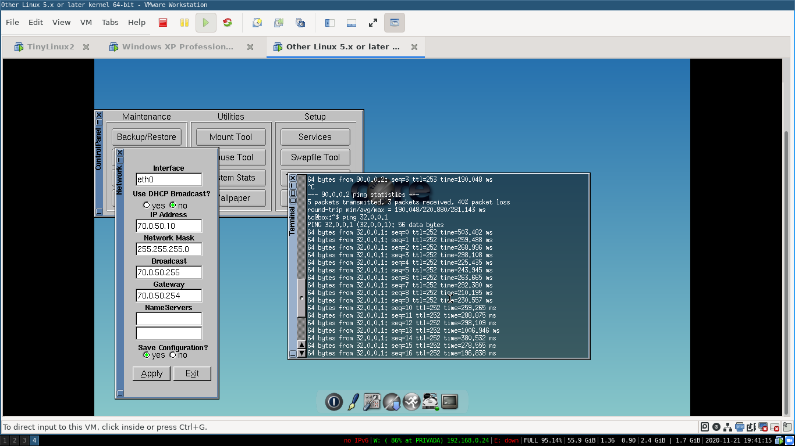

# Redes1-Practica5_Grupo12
## 201700326
## 201709244

## Numero de host para las topologias

| Departamento | Cantidad de host |
| -------------|:----------------:|
| Profesores   | 42               |
| Estudiantes  | 72               |
| Invitados    | 22               |

## Definición de las redes por vlsm

| Direccion de Red | Primera Direccion Asignable | Ultima Direccion Asignable | Direccion de Broadcast |
|:-------------:|:-------------:|:-------------:|:-------------:| 
| 192.168.0.0/25 | 192.168.0.1 | 192.168.0.126 | 192.168.0.127 |
| 192.168.0.128/26 | 192.168.0.129 | 192.168.0.190 | 192.168.0.191 |

<h2>Topologia 1</h2>

## Configuracion

### Creación de VLANS

#### Comandos:
- conf t
- vlan {numero}
- name {nombre}
- end
  
Podemos ver en el ESW con vl, si estan todas las vlans creadas

### Configuración de puertos
- conf t
- interface {interface}
- switchport mode trunk
- end

Verificamos con "sh interfaces status"

En el switch de capa dos, con la ayuda de la GUI configuramos modo access y trunk

### Gateway VLANS

Como tenemos 2 vlans, se procede a hacer subinterfaces

#### Comandos:
- conf t
- interface {nombre}
- ip address {ip} {mascara de subred}
- end

Verificamos con "sh ip interface brief"

### Ruteo estatico
Para poder acceder a la topologia 2, se debe aprender las redes que no ve el router

#### Comandos:
- conf t
- ip route {ip de la red} {mascara de la red} {ip de la interfaz}
- end

Para corroborar esto, se debe hacer ping desde un cliente a la otra topologia

<h2>Topologia 2</h2>

## Configuracion

### Creación de las VLANs

Es necesario crear la vlan nativa de esta topología (INVITADOS) como 
también crear las vlans que se espera recibir de la topología 1 
(PROFESORES y ESTUDIANTES). Se procede entonces a crear las vlans.
#### Comandos:
- conf t
- vlan {numero}
- name {nombre}
- end
  
Podemos ver en el ESW2 con el comando sh vlan-sw,
si estan todas las vlans creadas.

### Configuración de puertos
Configuramos los puertos en modo Trunk para admitir conexión intervlan.

- conf t
- interface {interface}
- switchport mode trunk
- end

### EIGRP

Procedemos a configurar el EIGRP.

#### R2

##### Comandos
- conf t
- router eigrp 10
- network 10.10.0.0 0.0.0.255
- network 20.10.0.0 0.0.0.255
- network 192.168.15.0 0.0.0.255
- end

#### R3

##### Comandos
- conf t
- router eigrp 10
- network 10.10.0.0 0.0.0.255
- network 20.10.0.0 0.0.0.255
- network 192.168.15.0 0.0.0.255
- end

#### R4

##### Comandos
- conf t
- router eigrp 10
- network 10.10.0.0 0.0.0.255
- network 20.10.0.0 0.0.0.255
- network 192.168.15.0 0.0.0.255
- end

### VRRP
Ahora procedemos a configurar el VRRP.

#### R3
- conf t
- vrrp 10
- vrrp 10 ip 192.168.15.3
- vrrp 10 priority 120
- vrrp 10 preempt
- end

#### R4
- conf t
- vrrp 10
- vrrp 10 ip 192.168.15.3
- vrrp 10 priority 100
- end

### Ruteo estatico
Finalmente debemos aprender las redes de la topología 1. Hacemos 
esto de la siguiente manera:

#### Comandos:
- conf t
- ip route {ip de la red} {mascara de la red} {ip de la interfaz}
- end

Realizamos este proceso en todos los Routers de la topología (R2,R3,R4).

Finalmente comprobamos realizando un ping a clientes de la topología 1.

